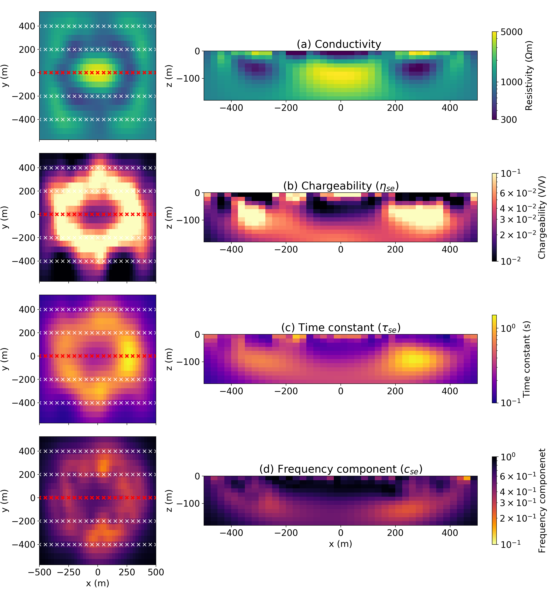
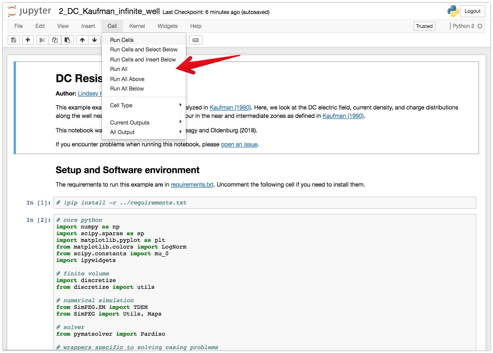

**| [Overview](#overview) | [Launching the notebooks](#launching-the-notebooks) | [Running the notebooks](#running-the-notebooks) | [Citation](#citation) | [Issues](#issues) | [License](#license) |**

# Inversions of time-domain spectral induced polarization data using stretched exponential

[](https://travis-ci.org/simpeg-research/kang-2018-spectral-inducedpolarization)
[](https://mybinder.org/v2/gh/simpeg-research/kang-2018-spectral-inducedpolarization/master?filepath=index.ipynb)
[](https://notebooks.azure.com/import/gh/simpeg-research/kang-2018-spectral-inducedpolarization)
[](https://zenodo.org/badge/latestdoi/127807359)
[](https://github.com/simpeg-research/kang-2018-spectral-inducedpolarization/blob/master/LICENSE)
[](http://simpeg.xyz)



## Overview

This repository contains the notebooks used to generate the examples shown in "Inversions of time-domain spectral induced polarization data using stretched exponential" by [Seogi Kang](https://github.com/sgkang) and [Douglas W. Oldenburg](https://github.com/dougoldenburg). The list of the notebooks are:

- [notebooks](notebooks): contains the notebooks used to generate figures in the paper and thesis
    - [1-Plot-Cole-Cole.ipynb](notebooks/1-Plot-Cole-Cole.ipynb):
        - Figure 1
    - [2-Fit-ColeCole-with-StrechedExponential](notebooks/2-Fit-ColeCole-with-StrechedExponential.ipynb):
        - Figure 2
    - [3-DC-SIP-data](notebooks/3-DC-SIP-data.ipynb):
        - Figures 5 and 6
    - [4-DC-SIP-inversion-2D](notebooks/4-DC-SIP-inversion-2D.ipynb):
        - Figures 7-11
    - [5-DC_inversion_3D](notebooks/5-DC_inversion_3D.ipynb):
    - [6-1-SIP_inversion_3D](notebooks/6-1-SIP_inversion_3D.ipynb)
    - [6-2-SIP_inversion_3D_load](notebooks/6-2-SIP_inversion_3D_load.ipynb):
        - Figures 12-14
    - [6-2-SIP_inversion_3D_load](notebooks/6-2-SIP_inversion_3D_load.ipynb):
        - Figures 12-14
    - [7-Generate-porphyry-model-and-data](notebooks/7-Generate-porphyry-model-and-data.ipynb)
    - [8-IP_inversion_3D](notebooks/8-IP_inversion_3D.ipynb)
    - [9-Linearization-tests](notebooks/9-Linearization-tests.ipynb)


## Launching the notebooks

### Online
The notebooks can be run online through [mybinder](https://mybinder.org/v2/gh/simpeg-research/kang-2018-spectral-inducedpolarization/master?filepath=index.ipynb) or [azure notebooks](https://notebooks.azure.com/import/gh/simpeg-research/kang-2018-spectral-inducedpolarization).

### Locally
To run them locally, you will need to have python installed, preferably through [anaconda](https://www.anaconda.com/download/).

You can then clone this repository. From a command line, run

```
git clone https://github.com/simpeg-research/kang-2018-spectral-inducedpolarization.git
```

Then `cd` into the `kang-2018-spectral-inducedpolarization`

```
cd kang-2018-spectral-inducedpolarization
```

To setup your software environment, we recommend you use the provided conda environment

```
conda env create -f environment.yml
source activate emcyl-environment
```

alternatively, you can install dependencies through pypi
```
pip install -r requirements.txt
```

You can then launch Jupyter
```
jupyter notebook
```

Jupyter will then launch in your web-browser.

## Running the notebooks

Each cell of code can be run with `shift + enter` or you can run the entire notebook by selecting `cell`, `Run All` in the toolbar.



For more information on running Jupyter notebooks, see the [Jupyter Documentation](https://jupyter.readthedocs.io/en/latest/)

## Citation

Kang, S., & Oldenburg, D. W. (2019). Inversions of time-domain spectral induced polarization data using stretched exponential.

```
@article{kang2019,
author = {Kang, Seogi and Oldenburg, Douglas W},
journal = {Geophysical Journal International},
number = {},
pages = {},
title = {{Inversions of time-domain spectral induced polarization data using stretched exponential.}},
volume = {},
year = {}
}
```

## Issues

If you run into problems or bugs, please let us know by [creating an issue](https://github.com/simpeg-research/kang-2018-spectral-inducedpolarization/issues/new) in this repository.

## License

These notebooks are licensed under the [MIT License](/LICENSE) which allows academic and commercial re-use and adaptation of this work.

## Version

Version: 0.0.2
